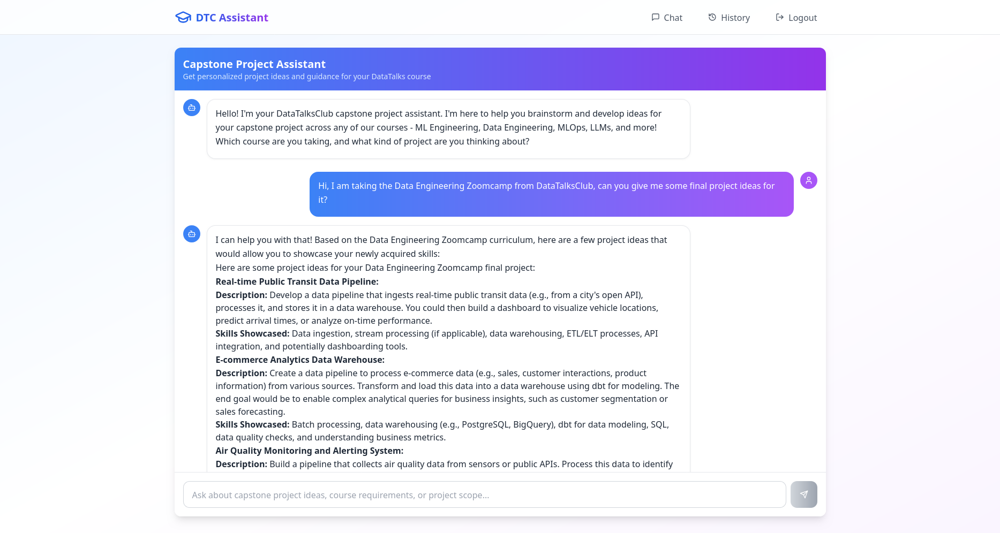

# Capstone Project Recommender ChatBot

## Project Overview

This project is an Agentic RAG-based ChatBot designed to assist students of DataTalksClub courses in generating ideas for their final capstone projects. The bot leverages previous project repositories' README files, stored in a Pinecone vector database, and uses LlamaIndex to build an intelligent agent capable of providing relevant recommendations and guidance.

## App Preview

Below is a preview of the Capstone Project Recommender ChatBot application:




## Features
- Agentic RAG (Retrieval-Augmented Generation) architecture
- Integration with Pinecone vector database for semantic search
- LlamaIndex-powered agent for context-aware responses
- Designed for DataTalksClub capstone project ideation

## Installation Instructions

1. **Clone the repository:**
   ```bash
   git clone https://github.com/hammadbinsajjad/Capstone-Project-Recommender.git
   cd Capstone-Project-Recommender
   ```

2. **Run with Docker Compose (Recommended):**
   - Make sure you have Docker and Docker Compose installed.
   - Run the following command to build and start the services:
     ```bash
     docker-compose up --build
     ```
   - This will start both the frontend and backend services automatically.

3. **Manual setup (for development):**
    - Setup and activate a virtual environment and install all dependencies:
       ```bash
       cd agent
       python3 -m venv .venv
       source .venv/bin/activate
       pip install -r requirements.txt
       ```

    - Rename `.env.example` to `.env` and fill in your required environment variables:

    - Edit .env and add your API keys and secrets

    - Install dependencies for the frontend
        ```bash
        cd ../frontend
        npm install
        ```

## Usage Guide

### Using Docker Compose

1. **Start all services:**
   ```bash
   docker-compose up --build
   ```
   - This will launch the backend, frontend, and any other required services.
   - Access the frontend via the URL provided by Docker Compose.

### Manual Usage (for development)

1. **Start the backend server:**
   ```bash
   cd backend
   python3 manage.py migrate
   python3 manage.py runserver
   ```

3. **Ingest new README files:**
    - **Download README files using Scrapy:**
       ```bash
       cd ingestion/readme_downloader
       scrapy crawl readme-spider -O output.json
       ```
    - **Embed and save to Pinecone Index:**
       ```bash
       cd ingestion/readme_embedder
       python embedder.py
       ```
4. **Run the frontend:**
   ```bash
   npm run dev
   ```
   - This will start the frontend development server.

## API Documentation

### Backend API Endpoints
- `/api/chat/` — Main chat endpoint for interacting with the agent
- `/auth/` — User authentication endpoints

Refer to the [API.md](API.md) file for detailed API documentation.

## Development Setup Guide

1. **Clone and set up the repository as above.**
2. **Install all dependencies in each module.**
3. **Configure environment variables:**
   - Copy `.env.example` to `.env` and set Pinecone API keys and other secrets as needed (see `config.py` files).
4. **Run tests:**
   - Use the provided test scripts in each module to validate functionality.
5. **Frontend development:**
   - Use Vite and Tailwind for frontend development. See `frontend/README.md` if available.

## Requirements
- Docker & Docker Compose (if using Docker setup)
- Python 3.12+
- Pinecone
- LlamaIndex
- Django
- Vite (for frontend)
- Other dependencies as listed in each `requirements.txt` or in the root folder as a whole

## License
See [LICENSE](LICENSE) for details.

## Contributing
See [CONTRIBUTING.md](CONTRIBUTING.md) for guidelines.

---

For questions or support, please open an issue or contact the maintainer.
